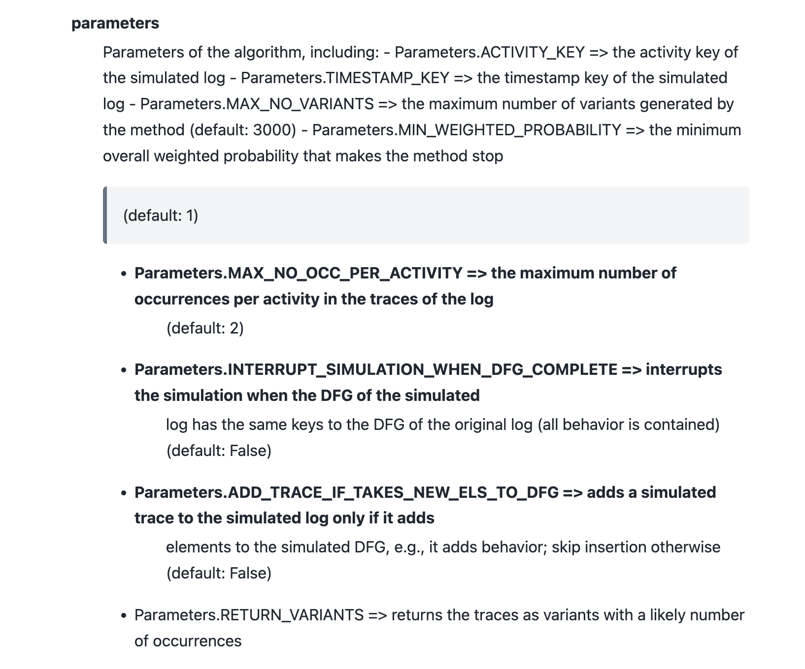

# Documentation Generation using Sphinx

The documentation is generated automatically using [Sphinx](https://www.sphinx-doc.org/en/master/index.html).

## First Time Generating the Documentation

Some additional requirements are needed (Assuming you already installed the standard requirements).
Install them to your virtual environment with 

`source ./venv/bin/activate`

`pip install -r docs/requirements_docs.txt`

Now you can generate the documentation with these commands

`cd docs`

`./build.sh` (MAC/Linux)

`./build.bat` (Windows)

## Warnings

When adding new docstrings, please do not ignore build warnings!
The docstrings must be valid
[reStructured text](https://restructuredtext-guide.readthedocs.io/en/latest/ch_syntax.html).
Otherwise, the output not be correctly rendered, see here:

## Footer and Header for the P.I.S. Website

In order to improve the embedding of the documentation into the P.I.S. website, the 
footer and header is added statically to the documentation. 
Per default, this is enabled. You can change it by toggling the `generate_for_website` flag.

If the header and footer changes, the please adapt `source/_templates/layout.html` accordingly.
Initially, the code and css from the website was copied over, for small changes it might be more
efficient to just add them in the layout file instead of copying over everything. 
Note that sphinx tends to add css of its own, so check if everything is creating as expected.

Also, I added the sphinx theme switcher to the P.I.S. navbar: ``.
